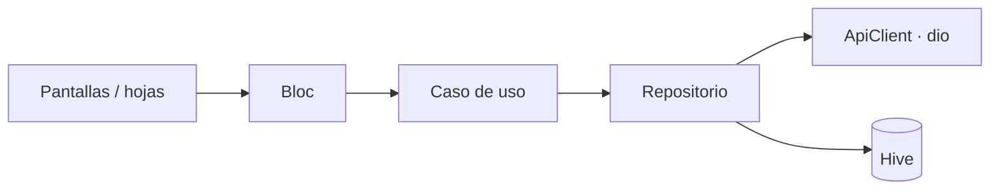

# Warehouse

App Flutter (Android + iOS) para gestionar un catálogo de productos sobre [CrudCrud](https://crudcrud.com).

## Inicio rápido

Requisitos: Flutter 3.47 (Dart 3.13) y Android SDK. En **Windows / Linux** corre en Android; en **macOS** además iOS (Xcode + CocoaPods).

```bash
cp .env.example .env.dev      # copy en Windows; igual para .env.qa / .env.prod
flutter pub get
dart run slang                # genera las traducciones
flutter run --flavor dev --dart-define-from-file=.env.dev
```

En VS Code, `.vscode/launch.json` trae Debug / Release × dev / qa / prod.

| Variable (`.env.<flavor>`) | Uso |
|---|---|
| `BASE_URL` | Endpoint de CrudCrud: `https://crudcrud.com/api/<id>` |
| `API_KEY` | Header `x-api-key`; vacío = no se envía |
| `SENTRY_DSN` | Vacío = Sentry apagado |

El ambiente no vive en el `.env`: sale del flavor, así no pueden desalinearse.

## Funcionalidades

| Requisito | Solución |
|---|---|
| Listar (nombre, SKU, precio, moneda, stock) | Skeletons y estados de error, vacío y sin resultados con reintento |
| Buscar por nombre o SKU | Debounce de 350 ms; ignora mayúsculas, espacios y guiones (`1004` → `SKU-1004`) |
| Editar solo el precio | Hoja con validación en vivo (`precio > 0`, moneda no vacía) antes de tocar la red |
| Ordenar por precio, nombre y SKU | Orden estable (desempate por id); USD se compara convertido a BOB |
| Compartir | `MethodChannel` propio (`app/share`) en Kotlin y Swift; texto estructurado Nombre / Precio / SKU |
| Bloc y widgets genéricos | `flutter_bloc`; componentes reutilizables en `lib/shared/widgets` |
| **Plus** | Filtros (precio, moneda, stock), paginación, cache offline con Hive, API key, Sentry, crear / eliminar, i18n es / en / pt, tema claro / oscuro, flavors |

## Arquitectura

Clean architecture con un único módulo (`catalog`).

```
lib/
├── app/               composición: arranque, DI (get_it), router (go_router), env
├── core/              infraestructura sin UI: red, Failure, Hive, share, tema, i18n
├── shared/            widgets y formatters reutilizables
└── modules/catalog/
    ├── domain/        Dart puro: entidades, contratos, casos de uso, validadores
    ├── data/          DTOs, datasources (remoto / Hive), repositorios
    ├── application/   blocs
    └── presentation/  pantallas, hojas y widgets del módulo
```



- **Domain** no conoce Flutter, dio ni JSON; los repositorios solo lanzan `Failure`.
- **`ProductsBloc`** es compartido: búsqueda, orden, filtros y paginación se resuelven en cliente (CrudCrud no filtra).
- **Cada hoja** tiene su propio bloc; los envíos usan `droppable()` y la hoja no se cierra con una petición en curso.
- Reconstrucciones mínimas con `context.select` / `BlocSelector` (ver [CONTRIBUTING](CONTRIBUTING.md#reconstrucciones)).

## Decisiones técnicas

| Decisión | Por qué |
|---|---|
| `Failure(type, statusCode, detail)` + `enum FailureType` | `switch` exhaustivo; el mensaje se traduce en la UI y el detalle técnico no se filtra en `toString()` |
| `ApiClient` con un único `_send` | Toda respuesta sale como dato o `Failure`; un error de parseo indica el campo exacto |
| Logger propio | Legible y censura `x-api-key`, tokens y contraseñas; solo en debug |
| Sentry acotado | Issue solo para bugs reales (parse, inesperados, 400/405/5xx); 404 y 429 como breadcrumb; sin PII |
| Hive sin adapters | Mapas JSON, sin `build_runner`; cache corrupto se descarta |
| Sin paquetes evitables | Share, splash y logging propios; sin `share_plus`, `shared_preferences`, `connectivity_plus` |
| Peso y rendimiento | Fuentes variables recortadas (140 KB), íconos WebP, texto con `sizer` calibrado y medidas fijas |

## Flavors

| Flavor | Nombre | Bundle / applicationId |
|---|---|---|
| dev | Warehouse Dev | `com.bancosol.warehouse.dev` |
| qa | Warehouse QA | `com.bancosol.warehouse.qa` |
| prod | Warehouse | `com.bancosol.warehouse` |

iOS: Xcode no entiende `--dart-define-from-file`, así que cada scheme tiene una pre-action (`ios/scripts/generate_dart_defines_xcconfig.sh`) que genera `DartDefines.xcconfig` desde `.env.<flavor>`; un Archive arranca con su configuración. `ios/scripts/setup_flavors.rb` solo se vuelve a correr al agregar un flavor.

## Tests

```bash
flutter test --coverage --dart-define-from-file=.env.dev
```

Pocos tests, uno por regla de negocio:

| Capa | Reglas |
|---|---|
| Red | Cada error HTTP se mapea a su `FailureType`; GET con 500 reintenta, POST nunca; secretos fuera de logs y Sentry |
| Dominio | Validación de precio en orden antes de la red; búsqueda por SKU sin guion; orden estable; páginas de 10 |
| Datos | Sin conexión se muestra el cache como offline; un 500 no se disfraza de offline; el PUT no envía `_id` |
| Estado | Un refresco fallido no borra la lista; buscar vuelve a la página 1; un 404 al eliminar cuenta como eliminado |
| UI | Guardar deshabilitado con el mismo precio; tras error el botón pasa a "Reintentar"; el formatter conserva el cursor |
| DI | El grafo completo se resuelve y los interceptores van en orden |

CI (`.github/workflows/ci.yaml`) ejecuta formato, análisis, tamaño de pantallas y tests con cobertura.

## Limitaciones

- CrudCrud gratuito expira y limita peticiones: un 429 se informa y reintenta; si expiró, crear otro endpoint y cambiar `BASE_URL`.
- `PUT` reemplaza el documento entero, por eso se envían todos los campos.
- El build release firma con las claves de debug.

## Contribuir

Ramas, commits y reglas de código en [CONTRIBUTING.md](CONTRIBUTING.md).
