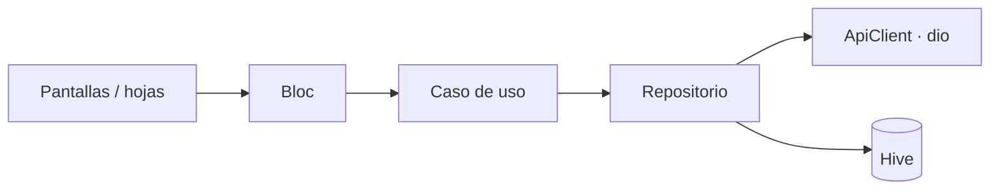

# Warehouse

App Flutter (Android + iOS) para gestionar un catálogo de productos sobre [CrudCrud](https://crudcrud.com).

## Inicio rápido

Requisitos: Flutter 3.47 (Dart 3.13) y Android SDK. En **Windows / Linux** corre en Android; en **macOS** además iOS (Xcode + CocoaPods).

```bash
cp .env.example .env.dev      # copy en Windows; igual para .env.qa / .env.prod
flutter pub get
dart run slang                # genera las traducciones
flutter run --flavor dev --dart-define-from-file=.env.dev
```

En VS Code, `.vscode/launch.json` trae Debug / Release × dev / qa / prod.

| Variable (`.env.<flavor>`) | Uso |
|---|---|
| `BASE_URL` | Endpoint de CrudCrud: `https://crudcrud.com/api/<id>` |
| `API_KEY` | Header `x-api-key`; vacío = no se envía |
| `SENTRY_DSN` | Vacío = Sentry apagado |

El ambiente no vive en el `.env`: sale del flavor, así no pueden desalinearse.

## Criterios de aceptación

| # | Criterio | Implementación |
|---|---|---|
| 1 | Listar nombre, SKU, precio, moneda y stock | Lista paginada con tarjetas reutilizables |
| 1 | Carga y errores | Skeletons; estados de error, vacío y sin resultados con reintento |
| 2 | Buscar por nombre o SKU | Debounce de 350 ms; ignora mayúsculas, espacios y guiones (`1004` → `SKU-1004`) |
| 3 | Editar solo el precio | Hoja que solo expone el campo precio; nombre, SKU, moneda y stock se conservan |
| 3 | Reflejar el cambio en el listado | El producto se actualiza en el bloc compartido y se resalta unos segundos |
| 3 | Carga y errores | Botón con progreso, hoja bloqueada durante el envío, error → "Reintentar" |
| 4 | Ordenar por precio asc / desc | Mayor precio / Menor precio; USD se convierte a BOB para comparar |
| 4 | Ordenar por nombre y SKU | Nombre A–Z y SKU A–Z, sin distinguir mayúsculas; empates se resuelven por id para que el orden no salte entre recargas |
| 5 | Compartir con el sheet nativo | `MethodChannel` propio (`app/share`): `ACTION_SEND` en Kotlin, `UIActivityViewController` en Swift |
| 5 | Información estructurada | Una línea por campo (`Nombre: …` / `Precio: 1,500.50 BOB` / `SKU: …`) en el idioma activo; el nombre va como asunto para correo |
| — | `precio > 0` y moneda no vacía | Validación en vivo en dominio, antes de tocar la red (ver [Validaciones](#validaciones)) |
| — | Errores claros | `Failure` tipado traducido a un mensaje por caso (offline, 404, 429, servidor…) |
| — | Componentes genéricos | `CustomScaffold`, `CustomInput`, `CustomBottomSheet`, `AppButton`, `AppStateView` en `lib/shared/widgets` |
| — | Manejo de estado | `flutter_bloc` |

### Validaciones

Viven en `domain/validators`, se muestran en vivo y bloquean el envío antes de tocar la red.

| Campo | Reglas |
|---|---|
| Precio | Obligatorio; número con hasta 2 decimales (rechaza `12.`, `NaN`, `1e5`); `> 0`; `≤ 999,999.99`; distinto al actual. Un cambio ≥ 50 % avisa sin bloquear |
| Moneda | No vacía |
| Nombre | ≥ 3 caracteres, no solo números, no repetido |
| SKU | ≥ 4 caracteres, mayúsculas, números y guiones (`SKU-1003`), no repetido sin distinguir mayúsculas |
| Stock | Entero entre 0 y 99,999 |
| Filtro de precio | Mínimo ≤ máximo |

Nombre, SKU y stock aplican al crear un producto; al editar solo se valida el precio.

## Plus

Se cubrieron todos los plus sugeridos:

1. **Paginación**: páginas de 10 con paginador numerado, "Mostrando 1–10 de N" y pull to refresh.
2. **Filtros**, en la misma hoja "Ordenar y filtrar", combinables con búsqueda y orden:
   - Rango de precio en BOB: mínimo, máximo o ambos.
   - Moneda: Todas, BOB o USD.
   - Solo con stock: oculta los productos con stock 0.
   - "Ver N productos" cuenta en vivo antes de aplicar; un badge en el buscador muestra los filtros activos y "Restablecer" los limpia.
3. **Cache local (Hive)**: sin conexión muestra el último listado marcado como offline; se puede desactivar o sincronizar desde Ajustes.
4. **Header API key**: `x-api-key` desde el `.env` en cada petición.
5. **Telemetría y errores**:
   - Sentry con captura de pantalla, solo para bugs reales; sin PII ni secretos.
   - Logging legible de peticiones en debug, con secretos censurados.
   - Reintento automático de GET ante 5xx y espera ante 429.
6. **UI cuidada**: tema claro / oscuro, skeletons, estados vacío / error / sin resultados.
7. **Diseño de pantallas**: Resumen (valor del inventario, stock bajo y sin stock), Productos, Detalle y Ajustes (tema, idioma, cache, versión, prueba de Sentry).

### Extra

- **Crear y eliminar productos**, con las mismas validaciones y estados que la edición.
- **i18n** es / en / pt con cambio en vivo desde Ajustes.
- **Flavors** dev / qa / prod, cada uno con su nombre y bundle id (ver [Flavors](#flavors)).
- **Logo propio** como ícono de la app (adaptive icon en Android) en lugar del de Flutter.
- **Splash nativo** sin paquetes: `core-splashscreen` en Android y `LaunchScreen.storyboard` en iOS.
- **Hápticos nativos**: en iOS siguen el HIG de Apple; en Android, por `MethodChannel` (`app/haptics`), usan las constantes del sistema y solo se activan en equipos con actuador háptico real, porque en los que solo tienen motor de vibración la respuesta se siente tosca.

## Arquitectura

Clean architecture con un único módulo (`catalog`).

```
lib/
├── app/               composición: arranque, DI (get_it), router (go_router), env
├── core/              infraestructura sin UI: red, Failure, Hive, share, tema, i18n
├── shared/            widgets y formatters reutilizables
└── modules/catalog/
    ├── domain/        Dart puro: entidades, contratos, casos de uso, validadores
    ├── data/          DTOs, datasources (remoto / Hive), repositorios
    ├── application/   blocs
    └── presentation/  pantallas, hojas y widgets del módulo
```



- **Domain** no conoce Flutter, dio ni JSON; los repositorios solo lanzan `Failure`.
- **`ProductsBloc`** es compartido: búsqueda, orden, filtros y paginación se resuelven en cliente (CrudCrud no filtra).
- **Cada hoja** tiene su propio bloc; los envíos usan `droppable()` y la hoja no se cierra con una petición en curso.
- Reconstrucciones mínimas con `context.select` / `BlocSelector` (ver [CONTRIBUTING](CONTRIBUTING.md#reconstrucciones)).

## Decisiones técnicas

| Decisión | Por qué |
|---|---|
| `Failure(type, statusCode, detail)` + `enum FailureType` | `switch` exhaustivo; el mensaje se traduce en la UI y el detalle técnico no se filtra en `toString()` |
| `ApiClient` con un único `_send` | Toda respuesta sale como dato o `Failure`; un error de parseo indica el campo exacto |
| Logger propio | Legible y censura `x-api-key`, tokens y contraseñas; solo en debug |
| Sentry acotado | Issue solo para bugs reales (parse, inesperados, 400/405/5xx); 404 y 429 como breadcrumb; sin PII |
| Hive sin adapters | Mapas JSON, sin `build_runner`; cache corrupto se descarta |
| Sin paquetes evitables | Share, splash y logging propios; sin `share_plus`, `shared_preferences`, `connectivity_plus` |
| Peso y rendimiento | Fuentes variables recortadas (140 KB), íconos WebP, texto con `sizer` calibrado y medidas fijas |

## Flavors

| Flavor | Nombre | Bundle / applicationId |
|---|---|---|
| dev | Warehouse Dev | `com.bancosol.warehouse.dev` |
| qa | Warehouse QA | `com.bancosol.warehouse.qa` |
| prod | Warehouse | `com.bancosol.warehouse` |

iOS: Xcode no entiende `--dart-define-from-file`, así que cada scheme tiene una pre-action (`ios/scripts/generate_dart_defines_xcconfig.sh`) que genera `DartDefines.xcconfig` desde `.env.<flavor>`; un Archive arranca con su configuración. `ios/scripts/setup_flavors.rb` solo se vuelve a correr al agregar un flavor.

## Tests

```bash
flutter test --coverage --dart-define-from-file=.env.dev
```

| Capa | Reglas |
|---|---|
| Red | Cada error HTTP se mapea a su `FailureType`; GET con 500 reintenta, POST nunca; secretos fuera de logs y Sentry |
| Dominio | Validación de precio en orden antes de la red; búsqueda por SKU sin guion; orden estable; páginas de 10 |
| Datos | Sin conexión se muestra el cache como offline; un 500 no se disfraza de offline; el PUT no envía `_id` |
| Estado | Un refresco fallido no borra la lista; buscar vuelve a la página 1; un 404 al eliminar cuenta como eliminado |
| UI | Guardar deshabilitado con el mismo precio; tras error el botón pasa a "Reintentar"; el formatter conserva el cursor |
| DI | El grafo completo se resuelve y los interceptores van en orden |

CI (`.github/workflows/ci.yaml`) ejecuta formato, análisis, tamaño de pantallas y tests con cobertura.

## Limitaciones

- CrudCrud gratuito expira y limita peticiones: un 429 se informa y reintenta; si expiró, crear otro endpoint y cambiar `BASE_URL`.
- `PUT` reemplaza el documento entero, por eso se envían todos los campos.
- El build release firma con las claves de debug.

## Contribuir

Ramas, commits y reglas de código en [CONTRIBUTING.md](CONTRIBUTING.md).
