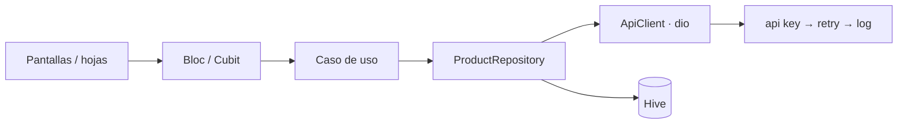

# WareHouse

App Flutter (Android + iOS) para gestionar un catálogo de productos sobre la API de [CrudCrud](https://crudcrud.com).

| Requisito del examen | Cómo se resolvió |
|---|---|
| Listar productos (nombre, SKU, precio, moneda, stock) con carga y errores | Skeletons, estados de error / vacío / sin resultados con reintento |
| Buscar por nombre o SKU | Debounce de 350 ms; ignora mayúsculas, espacios y guiones (`1004` encuentra `SKU-1004`) |
| Editar **solo** el precio | Hoja con validación en vivo; `precio > 0` y `moneda no vacía` se validan antes de tocar la red |
| Ordenar por precio (asc/desc), nombre y SKU | Orden estable (desempata por id); USD se compara convertido a BOB |
| Compartir producto con el share sheet nativo | `MethodChannel` propio (`app/share`) en Kotlin y Swift, texto estructurado Nombre / Precio / SKU |
| Bloc, reutilización de widgets | `flutter_bloc`; widgets genéricos en `lib/shared/widgets` |

**Plus implementados:** filtros (rango de precio, moneda, solo con stock), paginación de 10, cache local con Hive (muestra el último listado sin conexión), header API key, telemetría con Sentry, crear y eliminar productos, i18n es / en / pt con cambio en vivo, tema claro / oscuro, flavors dev / qa / prod.

## Requisitos

- Flutter 3.47 (Dart 3.13)
- Xcode con un simulador iOS y CocoaPods
- Android SDK con un emulador

## Puesta en marcha

```bash
cp .env.example .env.dev        # y .env.qa / .env.prod si se usan esos flavors
flutter pub get
dart run slang                  # genera las traducciones (lib/core/i18n/strings*.g.dart)
flutter run --flavor dev --dart-define-from-file=.env.dev
```

En VS Code, `.vscode/launch.json` trae las 6 combinaciones (Debug / Release × dev / qa / prod).

| Variable | Uso |
|---|---|
| `BASE_URL` | Endpoint de CrudCrud, p. ej. `https://crudcrud.com/api/<id>` |
| `API_KEY` | Se envía como header `x-api-key` (CrudCrud lo ignora; vacío = no se envía) |
| `SENTRY_DSN` | Vacío = Sentry apagado en ese ambiente |

El ambiente **no** está en el `.env`: sale del flavor (`appFlavor`), así no pueden desalinearse.

### Flavors

| Flavor | Nombre | Android `applicationId` / iOS bundle id |
|---|---|---|
| dev | WareHouse Dev | `com.bancosol.warehouse.dev` |
| qa | WareHouse QA | `com.bancosol.warehouse.qa` |
| prod | WareHouse | `com.bancosol.warehouse` |

### iOS: Archive desde Xcode

`--dart-define-from-file` es un flag de la CLI de Flutter; Xcode no lo conoce. Por eso cada scheme (`dev`, `qa`, `prod`) tiene una *pre-action* que ejecuta `ios/scripts/generate_dart_defines_xcconfig.sh .env.<flavor>`: escribe `ios/Flutter/DartDefines.xcconfig` (ignorado por git) con las variables en base64. Así un Archive para TestFlight arranca con su `BASE_URL` y no con una pantalla en blanco.

Las build configurations y schemes por flavor se crearon con `ios/scripts/setup_flavors.rb` (gem `xcodeproj`); el script es idempotente y solo hace falta volver a correrlo si se agrega un flavor.

## Arquitectura

Clean architecture por capas, con **un solo módulo** (`catalog`) porque la app es un único flujo.

```
lib/
├── app/                  raíz de composición: arranque, DI (get_it), router (go_router), Sentry, env
├── core/                 infraestructura que NO dibuja: red, Failure, Hive, tema, i18n, utilidades de tiempo
├── shared/               lo que dibuja y se reutiliza en toda la app
│   ├── widgets/          CustomScaffold, CustomInput, CustomBottomSheet, AppButton, AppStateView, AppNavBar…
│   └── formatters/       formato de precio y TextInputFormatters (precio, SKU, stock, nombre)
└── modules/catalog/
    ├── domain/           Dart puro: entidades, interfaces de repositorio, casos de uso, validadores, ProductQuery
    ├── data/             DTOs, ApiClient remoto, cache Hive, MethodChannel de compartir, repositorio
    ├── application/      ProductsBloc (catálogo) y cubits por pantalla / hoja
    └── presentation/     pantallas, hojas y widgets propios del catálogo
```



- **Domain** no importa Flutter, dio ni JSON. Los repositorios lanzan `Failure`; nunca una excepción de dio.
- **`ProductsBloc`** es único y compartido por Resumen, Productos y Ajustes: búsqueda, orden, filtros y paginación se calculan en cliente sobre la lista cargada (CrudCrud no filtra).
- **Cada hoja** (editar precio, nuevo producto, eliminar, filtros) crea su propio cubit, que muere al cerrarla. Mientras hay una petición en curso la hoja no se puede cerrar.
- **Reconstrucciones mínimas**: `context.select` en widgets chicos, `BlocSelector` para trozos de una pantalla grande, nunca un `BlocBuilder` alrededor de una pantalla. Estándar completo en [CONTRIBUTING.md](CONTRIBUTING.md#reconstrucciones).

## Decisiones técnicas

| Decisión | Por qué |
|---|---|
| `Failure(type, statusCode, detail)` con `enum FailureType` | El `switch` sobre el enum es exhaustivo; el texto para el usuario se resuelve en la UI con slang, así no queda congelado en un idioma. `InternalDetail` oculta el detalle técnico en `toString()` |
| `ApiClient` con un único `_send` | Toda respuesta o error sale como dato o `Failure`. Si un DTO no sabe leer la respuesta, el `Failure(parse)` lleva la línea exacta que falló |
| `RetryInterceptor` | Reintenta GET / PUT / DELETE ante timeout, 5xx o 429 (respeta `Retry-After`), por el mismo `Dio`. **Nunca POST**: un reintento podría crear el producto dos veces |
| Log propio que censura secretos | El `LogInterceptor` de dio imprime cuerpos y headers en crudo; el nuestro oculta `x-api-key`, tokens y contraseñas. Solo corre en debug |
| Sentry acotado | Issue solo para bugs reales (parse / inesperados y HTTP 400, 405, 5xx); 404 y 429 quedan como breadcrumb. `sendDefaultPii: false`, sin cuerpos y sin la api key |
| Cache Hive sin adapters | Se guardan mapas JSON: sin `build_runner`. El cache es descartable: si está corrupto se ignora y la app igual arranca |
| Fuentes variables | Outfit (sustituye a Poppins) y Playfair Display (sustituye a DM Serif Display), ambas variables, recortadas a latín y al eje 400–700: 140 KB en total |
| Tamaños de texto con `sizer` | Solo valores de una tabla px → sp calibrada en 411 × 891; paddings, radios y alturas son fijos para no descuadrar en tablet |
| Imágenes | Logo en WebP 1x / 2x / 3x, íconos de Android en WebP y PNG de iOS comprimidos; el logo se precarga |
| Splash nativo a mano | `core-splashscreen` en Android y `LaunchScreen.storyboard` en iOS; sin paquetes |
| Dependencias evitadas | `share_plus` (MethodChannel propio), `flutter_native_splash`, `shared_preferences` (Hive cubre), `connectivity_plus`, `logger`, `build_runner` |

## Testing

```bash
flutter test --dart-define-from-file=.env.dev
flutter test --coverage --dart-define-from-file=.env.dev
```

Pocos tests, cada uno una regla concreta. Algunos ejemplos:

| Capa | Reglas probadas |
|---|---|
| Red | Cada error HTTP / de red se traduce a su `FailureType`; un GET con 500 se reintenta y un POST nunca; los secretos no aparecen en los logs ni en Sentry |
| Dominio | El precio se valida en orden (vacío, decimales incompletos, ≤ 0, tope, moneda, sin cambios) antes de tocar la red; ≥ 50 % avisa sin bloquear; búsqueda por SKU sin guion; orden estable; paginación de 10 |
| Datos | Sin conexión y con cache se muestra el último listado como offline; un 500 no se disfraza de offline; el PUT no envía `_id` |
| Estado | Un refresco fallido no borra la lista; buscar vuelve a la página 1; el producto editado se resalta y se apaga solo; un 404 al eliminar se da por eliminado |
| UI | Guardar está deshabilitado con el mismo precio; tras un error de servidor el botón pasa a "Reintentar"; el formatter de precio mantiene el cursor |
| DI | Todo el grafo se resuelve y los interceptores van en orden |

CI (`.github/workflows/ci.yaml`): formato → `flutter analyze` → tests con cobertura.

## Limitaciones conocidas

- CrudCrud gratuito expira y limita la cantidad de peticiones por endpoint. Un 429 se informa al usuario y se reintenta con espera; si el endpoint expiró, hay que crear uno nuevo y cambiar `BASE_URL`.
- `PUT` en CrudCrud reemplaza el documento entero, así que se envían todos los campos (sin `_id`).
- La tasa USD → BOB es fija (6.96), como en el prototipo.
- Sin cola offline: crear, editar y eliminar requieren conexión.
- En Android, `ACTION_SEND` no informa si el usuario terminó de compartir; por eso el aviso "Compartido" solo aparece en iOS.
- El build release usa las claves de debug (prueba técnica).

## Convención de commits

[Conventional Commits](https://www.conventionalcommits.org): `type(scope): Descripción`, con gitflow (`main` ← `develop` ← `feature/*`). Ver [CONTRIBUTING.md](CONTRIBUTING.md).
